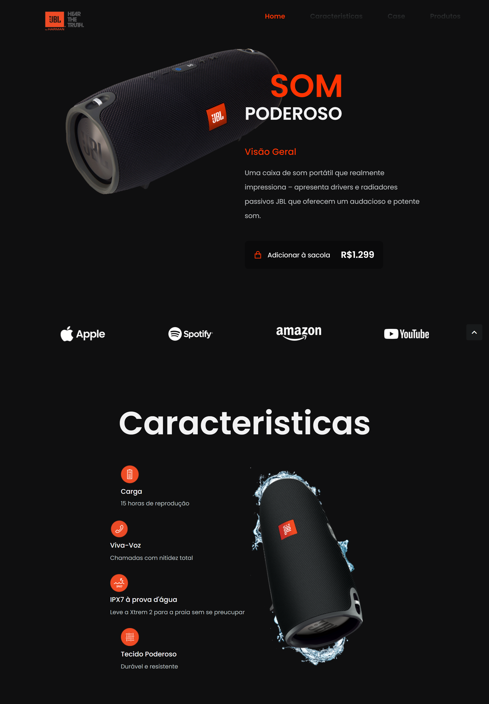

## JBL Landing Page UI Design

  
  

### Resumo

Jbl landing page é um projeto inspirado na JBL com o objetivo de trazer uma experiência diferenciada para o cliente utilizando Javascript, HTML5 e CSS3. Foi utilizado ScrollReveal neste projeto

### Motivação

O objetivo deste projeto era se familiarizar com estruturas do Javscript e ampliar minha capacidade com as tecnologias usadas.

### Construído com

- Html5
- CSS3
- JavaScript/ScrollReveal

### Recursos

**1. Design Responsivo.**

**2. ScrollReveal.**

**3. ScrollUp.**
